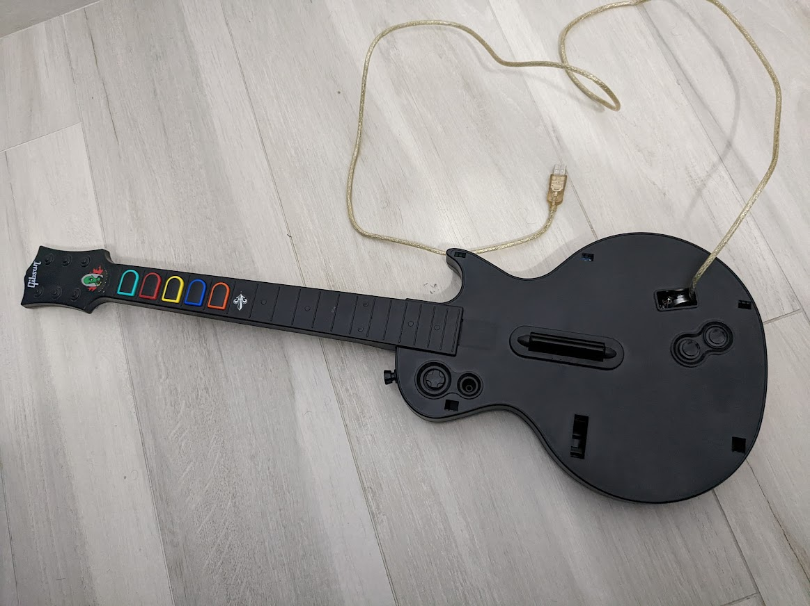
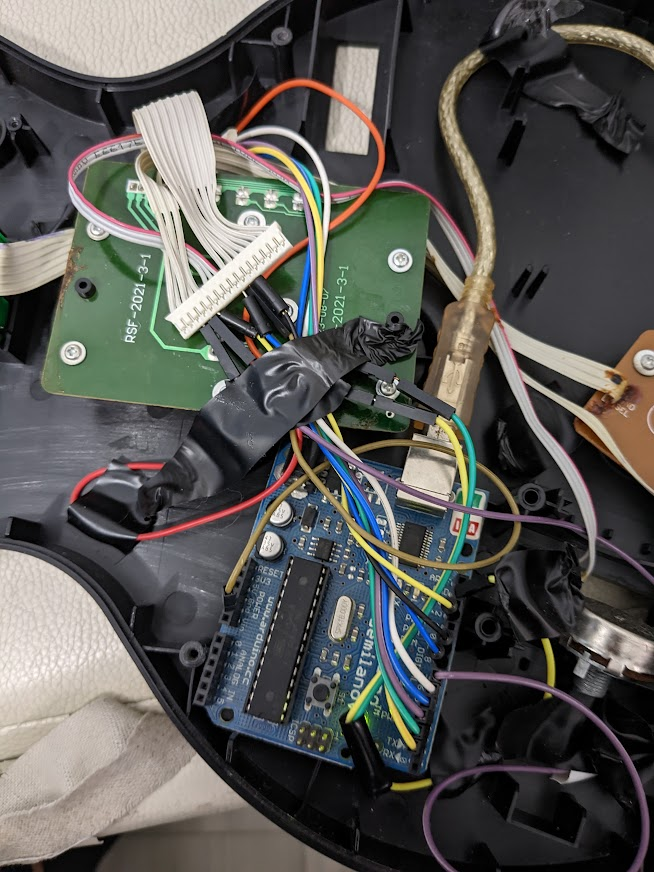

# arduino-guitar
Guitar Hero controller reconverted using Arduino

I took an old wireless Guitar Hero controller (Les Paul) for PS3, for which I missed the dongle, and integrated an Arduino Duemilanove to obtain an usable wired controller with low latency.
That in order to play Clone Hero (https://clonehero.net).

The code consists in two parts:
- Arduino code (.ino), to read the digital inputs from the pins connected to the buttons, and then send the information of pressed buttons through serial. In order to minimize the latency, serial information is sent only when the pressed buttons status changes (newly pressed button, or released), and the information is encoded into only 3 bytes.
- Python code (.py), to read the serial data, decode the protocol and send keyboard press events corresponding to the buttons. A feature for automatically pressing the whammy bar button can be eventually activated.

Here's how (messy) the guitar looks inside, with only one circuit board (green) from the original guitar and the Arduino (blue).

